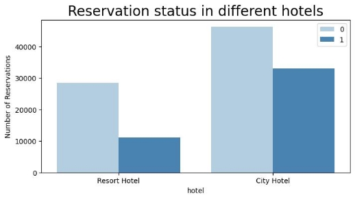
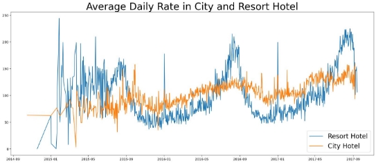
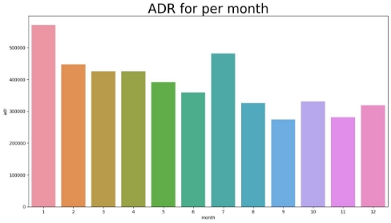
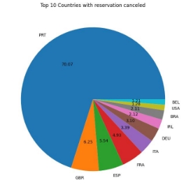
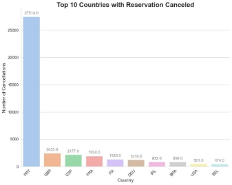

*Business Problem**

In recent years, City Hotel and Resort Hotel have seen high cancellation rates. Each hotel is now dealing with a number of issues as a result, including fewer revenues and less than ideal hotel room use. Consequently, lowering cancellation rates in both hotels’ Primary goal in order to increase their efficiency in generating revenue, and for us to offer thorough business advice to address this problem.

The analysis of hotel booking cancellations as well as other factors that have no bearing on their business and yearly revenue generation are the main topics of this report.

**Assumptions:**

1. No unusual occurrences between 2015 and 2017 will have a substantial impact on the data used.
1. The information is still current and can be used to analyze a hotel’s possible plans in an efficient manner.
1. There are no unanticipated negatives to the hotel employing any advised technique.
1. The hotels are not currently using any of the suggested solutions.
1. The biggest factor affecting the effectiveness of earning income is booking cancellations.
1. Cancellations result in vacant rooms for the booked length of time.
1. Clients make hotel reservations the same year they make cancellations.

**Research Questions:**

1. What are the variables that affect hotel reservation cancellations?
1. How can we make hotel reservations cancellations better?
1. How will hotels be assisted in making pricing and promotional decisions?

**Hypothesis:**

1. More cancellations occur when prices are higher.
1. When there is a longer waiting list, customers tend to cancel more frequently.
1. The majority of clients are coming from offline travel agents to make their reservations.

**Analysis and Findings:**

Cancellation Rates on the Hotels:

The data reveals that 37.1% of hotel reservations were canceled, resulting in a significant loss of revenue. A bar plot shows a clear contrast between the number of canceled (37.1%) and not canceled (62.9%) reservations. High cancellation rates lead to less ideal room usage and decreased revenue for hotels. Further analysis is necessary to identify factors contributing to high cancellation rates, such as pricing and waiting list length. By addressing these factors, we can develop strategies to reduce cancellations and improve revenue generation for hotels.

The graph shows the number of reservations canceled and not canceled for each hotel type, with the Resort Hotel facing a significantly higher proportion of cancellations (27.98%) compared to the City Hotel (41.71%). Further analysis revealed that 72.02% of reservations at the Resort Hotel were not canceled, while only 58.29% of reservations at the City Hotel were not canceled. It is recommended that the Resort Hotel management takes proactive steps to reduce cancellation rates by identifying contributing factors and implementing appropriate measures. For the City Hotel, monitoring trends and identifying areas of improvement is necessary to maximize revenue and minimize losses.

Factors of Cancellation Analysis:

1. Price(ADR) Analysis

The line graph provides a clear visual representation of the difference in average daily rates(ADR) between the City Hotel and Resort Hotel. While the City Hotel tends to have lower rates than the Resort Hotel on most days, there are certain days where the rates are even lower. This could be attributed to factors such as seasonality, competition, and other external factors.

It is important for the hotels to consider these factors while determining their pricing strategies. Additionally, the impact of pricing on reservation cancellations cannot be ignored. Further analysis is required to determine whether higher prices are leading to more cancellations, and if so, identify strategies to reduce the impact of cancellations on hotel revenue.

Therefore, while this line graph provides initial insights into the pricing strategies of both hotels, more detailed analysis is necessary to understand the impact of pricing on the business operations of these hotels.

2. Monthly Analysis

The grouped bar graph illustrates the monthly distribution of canceled and not-canceled reservations for hotels. August has the highest number of reservations,(which may be a popular vacation month) while January has the highest number of canceled reservations (possibly due to post-holiday season blues). This data can be utilized to develop strategies to improve cancellation rates and increase revenue during slower months. Understanding monthly reservation patterns is essential to improve business performance and customer satisfaction.

3. Combining both the above analysis and Concluding:

The cancellation rate of hotel reservations is affected by multiple factors, including pricing and monthly reservation patterns. The bar graph displays the average daily rate per month for canceled reservations, highlighting that cancellations are more frequent when prices are higher. The monthly distribution of canceled and not-canceled reservations for hotels also shows that certain months, such as January, see a higher number of cancellations. These insights underscore the importance of analyzing both pricing and monthly patterns to develop effective strategies that reduce cancellations, increase revenue, and enhance customer satisfaction.

4. Regional Analysis:

 

The data above shows the top 10 countries with the highest percentage of canceled reservations, with Portugal at the top of the list, accounting for 70.07% of all cancellations. It is essential to recognize this information and take action to minimize the impact of cancellations on the business. By analyzing the reasons behind the high cancellation rates from these countries and making the necessary changes to marketing strategies, hotel management can attract more stable customers and improve overall revenue. Additionally, offering incentives to customers from these countries may help to encourage them to keep their reservations and reduce the number of cancellations.

5. Market Segment Analysis:

The analysis shows that the largest market segment is Online TA, representing almost 47.44% of all reservations. This is followed by Offline TA/TO and Groups, with 20.32% and 16.66% respectively. Direct and Corporate make up smaller proportions of the reservations, with 10.47% and 4.30% respectively. Finally, Complementary and Aviation make up a very small proportion of the reservations.

When looking at the percentage of cancellations by market segment, the Online TA segment still has the highest percentage of cancellations, with 46.97%. The Groups segment has the second highest percentage of cancellations, at 27.40%. The Offline TA/TO segment has the third highest percentage of cancellations at 18.75%. Direct and Corporate segments have lower percentages of cancellations, at 4.35% and 2.21% respectively. Complementary and Aviation segments have the lowest percentages of cancellations.

The data on market segment distribution and cancellation rates highlights the importance of developing effective strategies for managing cancellations. Hotel management can use this information to identify areas for improvement and implement policies that encourage more stable bookings, such as offering incentives for group bookings or introducing stricter cancellation policies for online bookings. By taking necessary actions to reduce cancellation rates across different market segments, hotels can improve their overall reservation rate and increase revenue.

Concluding Analysis:

The line graph above provides valuable insights into the relationship between average daily rate (ADR) and reservation cancellations over time. The blue line representing the ADR for reservations that were not canceled shows a steady increase over time, indicating a positive trend in revenue. On the other hand, the orange line representing the ADR for canceled reservations fluctuates significantly, suggesting that price volatility has a greater impact on cancellation rates.

The graph also confirms earlier findings that higher prices lead to higher cancellation rates. As the ADR increases, so does the percentage of reservations that are canceled, highlighting the need for careful pricing strategies to avoid losing revenue due to cancellations. By monitoring ADR trends and adjusting prices during times of high cancellation rates, stakeholders can better manage revenue and minimize cancellations.

Overall, the project has analyzed various factors that contribute to reservation cancellations, including the top countries with the highest cancellation rates, the distribution of cancellations across different market segments, and the relationship between ADR and cancellation rates. The insights gained from this analysis can help stakeholders develop effective strategies to reduce cancellations, increase revenue, and improve overall hotel performance.

**Suggestions:**

Based on the analysis conducted, here are some suggestions aimed at addressing the business problem of reducing cancellation rates and increasing revenue:

1. **Change in Pricing Strategy:** It is recommended to consider a change in pricing strategy as a potential solution to address the issue of high cancellation rates. Specifically, the analysis suggests that cancellations are most common when prices are highest, and least common when they are lowest. Therefore, it may be beneficial to adjust pricing to incentivize customers to keep their reservations, such as offering special discounts or promotions during periods of low demand or adjusting pricing tiers to be more flexible.
1. **Offer incentives for early bookings:** One of the key factors identified as contributing to cancellations is last-minute changes in plans. To combat this, the hotels could offer incentives for customers who book their stays well in advance. For example, they could offer discounts or complimentary services for bookings made more than 30 days in advance.
1. **Implement flexible cancellation policies**: Another factor contributing to cancellations is the inflexibility of cancellation policies. By implementing more flexible policies, such as allowing customers to cancel or modify their bookings up to a certain date without penalty, the hotels could reduce the likelihood of cancellations.
1. **Target marketing campaigns to specific segments:** The analysis also revealed that certain market segments, such as Online TA and Groups, have higher cancellation rates than others. By targeting marketing campaigns specifically to these segments and tailoring offers to their needs and preferences, the hotels could increase the likelihood of these customers keeping their bookings and returning in the future.
